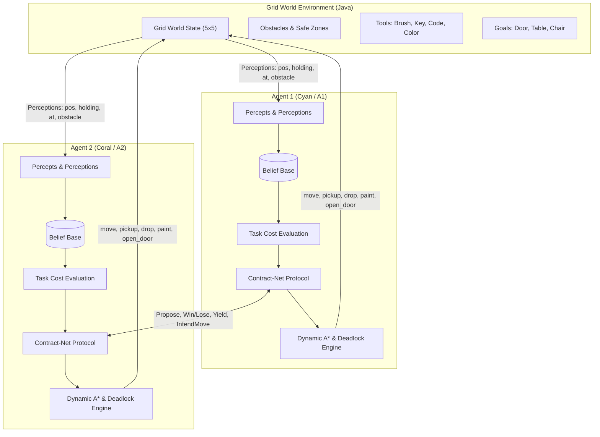
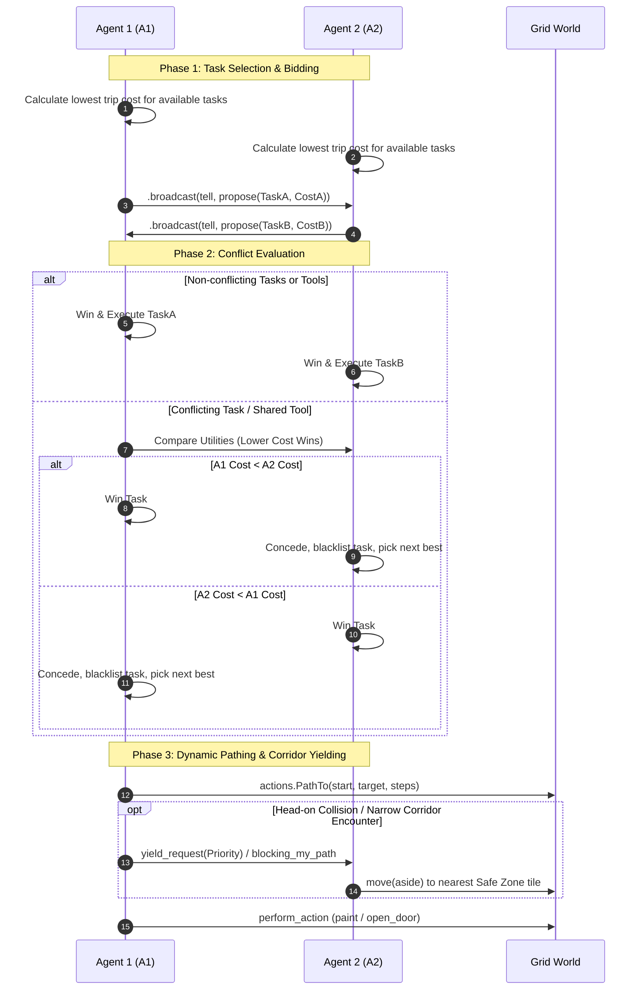

# Autonomous Grid World - Multi-Agent System (MAS)

[](https://openjdk.org/)
[](https://jason-lang.github.io/)
[](https://gradle.org/)
[](LICENSE)
[](https://github.com/)

> A decentralized, cooperative **Multi-Agent System (MAS)** built on the **Jason (AgentSpeak)** framework and the **BDI (Belief-Desire-Intention)** rational agency model. Autonomous agents communicate, negotiate task allocations under tool dependencies and weight constraints, resolve path deadlocks in narrow corridors, and optimize global episode utility within a dynamic 2D grid world.

---

## Key Capabilities & Highlights

- **BDI Cognitive Reasoning**: Agents operate on dynamic beliefs, intentions, and internal plans programmed in **AgentSpeak(L)**.
- **Distributed Contract-Net Negotiation**: Autonomous bidding protocol where agents calculate travel & tool-retrieval costs and cooperatively assign tasks to minimize total movement cost.
- **Dynamic A\* Pathfinding & Deadlock Resolution**: Real-time pathing that accounts for static obstacles, dynamic agent occupancy, corridor bottlenecks, and cooperative yield/step-aside maneuvers.
- **Weighted Movement Costs**: Realistic physics where carrying tools increases step cost ($1\times$ for 0 items, $2\times$ for 1 item, $4\times$ for 2 items), requiring optimal route ordering (e.g. sequence sorting for multi-tool tasks).
- **Modernized Swing Grid Visualizer**: High-DPI antialiased 2D interface with dark-mode slate theme, coordinate tracking, distinct color-coded agent tokens, and status feedback.

---

## System Architecture



---

## Domain Specifications

### 1. Agents

| Agent                  | Theme Color                | Starting Home | Role                           |
| :--------------------- | :------------------------- | :------------ | :----------------------------- |
| **Agent 1 (`agent1`)** | `Cyan / Teal` (`#06B6D4`)  | `(0, 4)`      | Autonomous Rational Cooperator |
| **Agent 2 (`agent2`)** | `Sunset Coral` (`#F97316`) | `(2, 2)`      | Autonomous Rational Cooperator |

### 2. Tools (Pickups)

| Tool      | Symbol | Theme Color             | Target Tasks           |
| :-------- | :----: | :---------------------- | :--------------------- |
| **Brush** | `[B]`  | Amber (`#F59E0B`)       | Painting Chair & Table |
| **Key**   | `[K]`  | Gold (`#EAB308`)        | Unlocking Door         |
| **Code**  | `[Cd]` | Indigo (`#6366F1`)      | Unlocking Door         |
| **Color** | `[Cl]` | Rose / Pink (`#EC4899`) | Painting Chair & Table |

### 3. Goals & Prerequisites

| Objective       | Symbol | Theme Color          | Required Tools    | Action Functor |
| :-------------- | :----: | :------------------- | :---------------- | :------------- |
| **Unlock Door** | `[D]`  | Emerald (`#10B981`)  | `Key` + `Code`    | `open_door`    |
| **Paint Table** | `[T]`  | Violet (`#A855F7`)   | `Brush` + `Color` | `paint(table)` |
| **Paint Chair** | `[Ch]` | Sky Blue (`#0EA5E9`) | `Brush` + `Color` | `paint(chair)` |

### 4. Movement Cost Formula

Carrying payload increases physical movement strain:
$$\text{Step Cost}(n) = \begin{cases} 1 & \text{if } n = 0 \text{ tools held} \\ 2 & \text{if } n = 1 \text{ tool held} \\ 4 & \text{if } n \ge 2 \text{ tools held} \end{cases}$$

$$\text{Final Episode Utility} = R_{\text{objectives}} - \frac{\text{Total Agent Path Costs}}{100}$$

---

## Negotiation & Deadlock Protocol



---

## Getting Started

### Prerequisites

- **Java JDK 21** (or Java 17 LTS)
- **Gradle** (or use the included `./gradlew` wrapper)

### Build

Compile Java internal actions and assemble resources:

```bash
./gradlew build
```

### Run Multi-Agent System

Launch the simulation with graphical visualization and real-time console streaming:

```bash
./gradlew run
```

---

## Repository Structure

```text
grid-agents/
├── build.gradle              # Gradle build script and dependencies
├── grid_agent.mas2j          # Jason Multi-Agent System declaration
├── src/
│   ├── agt/
│   │   └── agent1.asl        # AgentSpeak(L) BDI reasoning and coordination plans
│   └── java/
│       ├── Main.java         # Application launcher and GUI stream multiplexer
│       ├── actions/          # Custom Jason internal actions
│       │   ├── CalculateEpisodeScore.java  # Multi-agent scoring and utility
│       │   ├── DirsToLocs.java             # Direction-to-coordinate mapper
│       │   ├── GetSafeTile.java            # BFS safe-tile escape finder
│       │   ├── IsBlocked.java              # Collision and obstacle inspector
│       │   ├── PathCost.java               # A* heuristic cost evaluator
│       │   └── PathTo.java                 # Dynamic A* pathfinder
│       └── env/
│           └── GridEnvironment.java       # Grid simulation model & Swing visualizer
└── README.md
```

---

## License

This project is licensed under the [MIT License](LICENSE).
